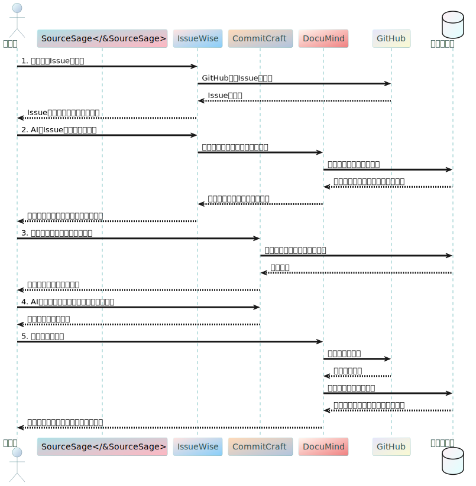

# PythonDiagrammatic


## TODO

Pythonでシーケンス図や構成図を生成するためのいくつかの人気のあるパッケージ

1. PlantUML:
   - PlantUMLは、シーケンス図、クラス図、アクティビティ図、コンポーネント図などの様々なUML図を生成するためのオープンソースツールです。
   - PythonからPlantUMLを使用するには、`plantuml`パッケージをインストールします。
   - PlantUMLの図はテキストベースの言語で記述され、それを図に変換します。
   - https://pypi.org/project/plantuml/

2. Diagrams:
   - Diagramsは、Pythonコードを使用してシーケンス図、フローチャート、ネットワーク図などを作成するためのパッケージです。
   - シンプルで直感的なPythonコードで図を定義し、画像ファイルとして出力できます。
   - https://pypi.org/project/diagrams/

3. Mermaid:
   - Mermaidは、マークダウンのようなシンプルな構文を使用してフローチャート、シーケンス図、ガントチャートなどを作成するためのツールです。
   - PythonからMermaidを使用するには、`mermaid-py`パッケージをインストールします。
   - https://pypi.org/project/mermaid-py/

4. Graphviz:
   - Graphvizは、グラフやネットワークの視覚化に使用されるオープンソースのツールです。
   - PythonからGraphvizを使用するには、`graphviz`パッケージをインストールします。
   - Graphvizは、DOT言語を使用してグラフを定義し、画像ファイルとして出力します。
   - https://pypi.org/project/graphviz/

5. NetworkX:
   - NetworkXは、複雑なネットワークの分析と可視化のためのPythonパッケージです。
   - ネットワークやグラフの構造を定義し、様々なレイアウトアルゴリズムを使用して可視化できます。
   - https://pypi.org/project/networkx/


## plantuml Tips

### setup

pip install plantuml


### example



```
python examples\plantuml\example03.py
```

### color list

https://github.com/qywx/PlantUML-colors/blob/master/plantuml-colors-notes.puml

```bash

...

actor "<color:DarkSlateGray>開発者</color>" as 開発者 #Azure/LightSteelBlue
participant "<&SourceSage>SourceSage</&SourceSage>" as SourceSage #PowderBlue/LightPink
participant "<color:DarkSlateGray>IssueWise</color>" as IssueWise #MistyRose/LightSkyBlue
...

```

### Color docs

https://plantuml.com/ja/color
