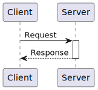
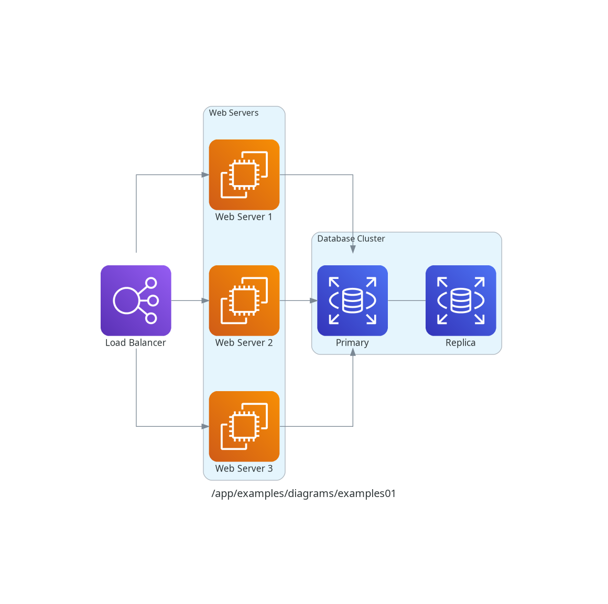
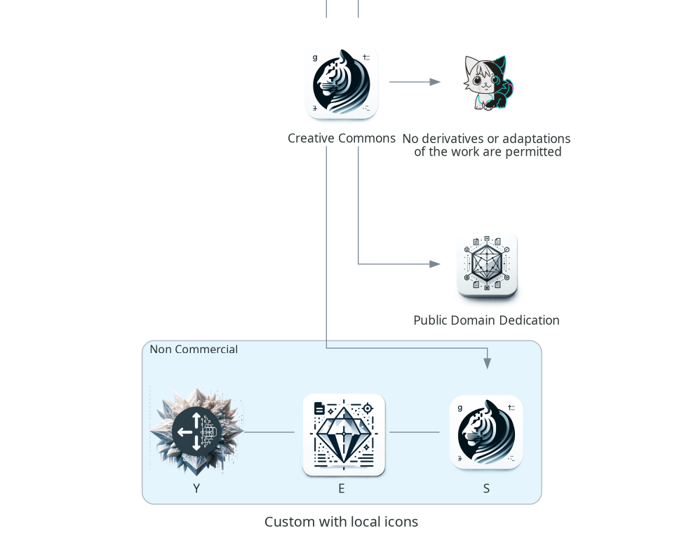

<p align="center">

<br>
<h1 align="center">PythonDiagrammatic</h1>
<h2 align="center">～Sketch to Structure～</h2>
</p>

## 更新情報

- 2024-03-31
  - PlantUMLの説明を追加し、パッケージ情報をより明確にしました。
  - PlantUMLの使用に関する簡単なリファレンスと利用例を示しました。


## TODO

- [x] PlantUMLのサンプルコードを追加する。
- [ ] Diagramsのサンプルコードを追加する。
- [ ] Mermaidのサンプルコードを追加する。
- [ ] Graphvizのサンプルコードを追加する。
- [ ] NetworkXのサンプルコードを追加する。
- [ ] 新しいパッケージの紹介を検討する（リクエストがあれば）。
- [ ] ドキュメントの充実化を図る（使い方、サンプル図の追加など）。
- [ ] プロジェクトの機能拡張（新しいダイアグラムの種類、カスタマイズオプションなど）。
- [ ] コミュニティからのフィードバックを収集し、改善点を見出す。

## はじめに

PythonDiagrammaticは、Pythonを使ってシーケンス図や構成図などのダイアグラムを簡単に作成するためのプロジェクトです。
初心者でも直感的にダイアグラムを描けるように、人気のあるパッケージをいくつか紹介しています。

## 紹介するパッケージ

1. PlantUML:
   - PlantUMLは、シーケンス図、クラス図、アクティビティ図、コンポーネント図など様々なUML図を生成できるオープンソースツールです。
   - テキストベースの言語で図を記述し、それを図に変換します。
   - Pythonから使うには、`plantuml`パッケージをインストールします。
   - https://pypi.org/project/plantuml/

2. Diagrams:
   - Diagramsは、Pythonのコードを使ってシーケンス図、フローチャート、ネットワーク図などを作成するパッケージです。
   - シンプルで分かりやすいPythonコードで図を定義し、画像ファイルとして出力できます。 
   - https://pypi.org/project/diagrams/

3. Mermaid:
   - Mermaidは、マークダウンに似たシンプルな構文でフローチャート、シーケンス図、ガントチャートなどを作成するツールです。
   - Pythonから使うには、`mermaid-py`パッケージをインストールします。
   - https://pypi.org/project/mermaid-py/

4. Graphviz:
   - Graphvizは、グラフやネットワークを可視化するためのオープンソースツールです。
   - PythonからGraphvizを使うには、`graphviz`パッケージをインストールします。
   - DOT言語でグラフを定義し、画像ファイルとして出力します。
   - https://pypi.org/project/graphviz/

5. NetworkX:
   - NetworkXは、複雑なネットワークを分析・可視化するためのPythonパッケージです。
   - ネットワークやグラフの構造を定義し、様々なレイアウトアルゴリズムで可視化できます。
   - https://pypi.org/project/networkx/

## 使い方

各パッケージの基本的な使い方は、`examples`ディレクトリにサンプルコードがあります。
それぞれのサンプルを参考に、自分だけのダイアグラムを作ってみましょう！

## PlantUML

PlantUMLは、シンプルなテキストベースの言語を使ってUML図を描くことができるオープンソースツールです。Pythonから簡単にPlantUMLを使うことができ、シーケンス図やクラス図などを手軽に作成できます。


### インストール方法

PlantUMLをPythonから使うために、`plantuml`パッケージをインストールします。

```bash
pip install plantuml
```

### 基本的な使い方

PlantUMLでシーケンス図を描くには、`@startuml`と`@enduml`で図の範囲を指定し、その間にシーケンス図の要素を記述していきます。

以下は、クライアントとサーバー間の簡単なやり取りを表したシーケンス図の例です。

```python
from plantuml import PlantUML

server = PlantUML(url='http://www.plantuml.com/plantuml/svg/')

source = """
@startuml
participant Client
participant Server

Client -> Server: Request
activate Server
Server --> Client: Response
deactivate Server
@enduml
"""

output = server.processes(source)

with open('sequence.svg', 'wb') as f:
    f.write(output)
```

出力結果は以下のようになります。



### サンプルコード

PlantUMLの使い方をもっと知りたい方は、[`examples/plantuml`](examples/plantuml)ディレクトリにあるサンプルコードを参考にしてください。より複雑な例やカスタマイズ方法などが紹介されています。

### まとめ

PlantUMLを使えば、シンプルなテキストベースの記法で様々なUML図を描くことができます。PythonからPlantUMLを使う方法を覚えておけば、シーケンス図やクラス図などを手軽に作成・更新できるようになります。

詳しい使い方は`examples/plantuml`ディレクトリを参照してください。ぜひ一度PlantUMLを試してみてください。


## Diagrams

Diagramsは、Pythonのコードを使ってシーケンス図、フローチャート、ネットワーク図などを作成するパッケージです。シンプルで分かりやすいPythonコードで図を定義し、美しい画像ファイルとして出力できます。

### インストール方法

Diagramsを使うには、以下のコマンドでパッケージをインストールします。

```bash
pip install diagrams
```

#### ローカル環境の場合

Diagramsを使うには、Graphvizというツールが必要です。以下のリンクからGraphvizをダウンロードしてインストールしてください。

https://graphviz.org/download/

#### Dockerを使う場合

Dockerを使う場合は、以下のコマンドでDockerイメージを起動します。

```bash
docker-compose up
```

### 使い方

Diagramsを使ってシーケンス図を作成するには、以下のようなPythonコードを書きます。

```python
from diagrams import Cluster, Diagram
from diagrams.aws.compute import EC2
from diagrams.aws.database import RDS
from diagrams.aws.network import ELB

with Diagram("Web Service Diagram", show=False):
    lb = ELB("Load Balancer")
    
    with Cluster("Web Servers"):
        web_servers = [EC2("Web Server 1"),
                       EC2("Web Server 2"),
                       EC2("Web Server 3")]
    
    with Cluster("Database Cluster"):
        db_primary = RDS("Primary")
        db_replica = RDS("Replica")
        
    lb >> web_servers >> db_primary
    db_primary - db_replica
```

このコードでは、AWSのアイコンを使って、ロードバランサー、ウェブサーバー、データベースクラスターを表現しています。`>>`演算子で要素間の関係を示し、`-`で要素間の関連を表しています。

出力結果は以下のようになります。



### サンプルコード

Diagramsの使い方をもっと知りたい方は、[`examples/diagrams`](examples/diagrams)ディレクトリにあるサンプルコードを参考にしてください。

例えば、`example05.py`では、カスタムアイコンを使ってCreative Commonsのライセンスを表現しています。

```bash
python3 examples/diagrams/example05.py 
```



### まとめ

Diagramsを使えば、Pythonのコードを書くだけで、簡単に美しい図を作成できます。インストールも使い方も簡単なので、初心者の方にもおすすめです。ぜひ一度試してみてください。


## 今後の予定

- 他のパッケージのサンプルコードを追加していく予定です。
- リクエストがあれば、新しいパッケージの紹介も検討します。

ぜひPythonDiagrammaticを使って、楽しくダイアグラムを作ってみてください！
